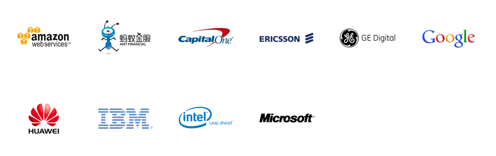



<h1> Joseph E. Gonzalez </h1>

<ul style="list-style-type:none">

<li> Assistant Professor, UC Berkeley </li>

  <li> <a href="http://eecs.berkeley.edu">Department of Electrical Engineering and Computer Science</a> </li>

  <li> <b>Office:</b> 773 <a href="https://goo.gl/maps/U7JiapPCY2x">Soda Hall</a>, Berkeley CA 94720</li>

  <li> <b>Office Hours:</b> 773 <a href="https://goo.gl/maps/U7JiapPCY2x">Soda Hall</a> Thursdays from 3:00PM to 5:00PM </li>

  <li> <b>Email:</b>
    
  </li>

  <li> <b>Twitter:</b> <a href="https://twitter.com/mejoeyg">@mejoeyg</a>,  someday I might start tweeting.</li>
  </ul>

I am an assistant professor in the <a href="http://www.eecs.berkeley.edu">EECS department</a> at UC Berkeley and a founding member of the new UC Berkeley [RISE Lab](http://rise.cs.berkeley.edu).  My [research interests](research) are at the intersection of machine learning and data systems and my students are working on a wide range of projects including:

* real-time model serving 
* machine learning life-cycle management
* accelerated deep learning for computer vision
* new cryptographic primitives for federated learning
* frameworks for deep reinforcement learning and parameter tuning
* model based cloud resource management
* software platforms for autonomous vehicles research
* computational efficient representations for asynchronous time series
* frameworks for graph query processing

<b>Co-founder:</b> I am also co-founder of <a href="http://Turi.com">Turi Inc.</a> (formerly GraphLab), which was originally based on my thesis work on the <a href="https://github.com/dato-code/PowerGraph">GraphLab and PowerGraph Systems</a>.  Turi was recently <a href="http://www.geekwire.com/2016/exclusive-apple-acquires-turi-major-exit-seattle-based-machine-learning-ai-startup/">acquired</a> by Apple Inc.

<b>Background:</b> Before joining UC Berkeley as an assistant professor, I was a post-doc in the UC Berkeley <a href="https://amplab.cs.berkeley.edu">AMPLab</a> working on several projects including <a href="http://spark.apache.org/graphx/">GraphX</a> (now part of <a href="http://spark.apache.org">Apache Spark</a>), early versions of <a href="http://mlbase.org">MLbase</a>, <a href="https://amplab.cs.berkeley.edu/projects/velox/">Velox</a>, and <a href="https://amplab.cs.berkeley.edu/projects/ccml/">concurrency control for ML</a>.
I obtained my PhD from the Machine Learning Department at Carnegie Mellon University
where I worked with on Parallel and Distributed Systems for Probabilistic Reasoning. 

 
## Current Graduate Students

I am fortunate to advise the following amazing students.

#### Graduate Students

* [Francios Belletti](https://github.com/bellettif)
* [Daniel Crankshaw](https://amplab.cs.berkeley.edu/author/crankshaw/)
* [Xin Wang](https://people.eecs.berkeley.edu/~xinw/)
* [Neeraja Yadwadkar](https://people.eecs.berkeley.edu/~neerajay/)
* [Richard Liaw](https://www.linkedin.com/in/richardliaw)
* [Vlad Feinberg](https://vlad17.github.io/about)

#### Masters Students

* [Corey Zumar](https://www.linkedin.com/in/corey-zumar-0a770982)
* [Alexander Ku](https://www.linkedin.com/in/alexyku/)
* [Samvit Jain](http://www.samvitjain.com)

#### Undergraduate Students

* [Noah Golmant](http://noahgolmant.com)
* [Yika Yujia Luo](https://www.linkedin.com/in/yika-yujia-luo-3a835b87)

## Prospective Postdocs and Graduate Students

We are looking for postdocs and graduate students to join the new <a href="https://rise.cs.berkeley.edu">UC Berkeley RISE Lab</a>.  As a founding member of the RISE Lab, I am working on several projects in large-scale systems for real-time and secure machine learning, time-series analysis, system management, and reinforcement learning.  My machine learning research spans both classical statistical machine learning methods as well as new work in deep learning.  If you are interested please consider applying to the UC Berkeley CS <a href="https://eecs.berkeley.edu/academics/graduate/research-programs/admissions">graduate program</a> in <a href="https://www2.eecs.berkeley.edu/Research/Areas/DBMS/">DBMS</a> or <a href ="https://www2.eecs.berkeley.edu/Research/Areas/AI/">AI</a>.

## Research Opportunities for Undergraduate Students

We are also looking for motivated undergraduate students who would like to get involved in doing cutting edge research.  If you are an undergraduate at Berkeley and are interested in getting involved in research please fill out this [Google Form](https://goo.gl/forms/OuubGEVi0U3l3Z2B2).

### Entrepreneurship 

I am currently on the technical advisory board for [Deepscale.ai](http://deepscale.ai) which is developing new computer vision software and systems for autonomous vehicles.  Deepscale.ai is currently hiring!

## Funding

My research as part of the UC Berkeley RISE Lab is funded by a group of 10 core industrial partners.

